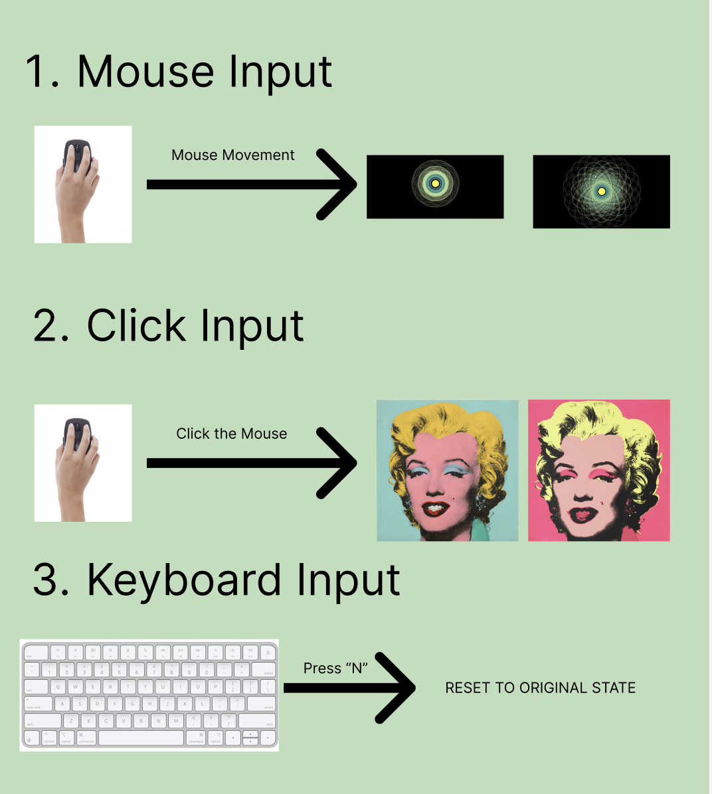

# Team_mtor0123_yulu0935_zhxu0527_9103_tut7-9

# Part 1: Project Direction

**Project Path:** Reinterpret an existing artwork

**Artist:** Andy Warhol
**Target Artwork:** **Shot Sage Blue Marilyn**

### Vision and Inspiration

Our vision reinterprets Warhol’s Pop Art through the lens of interactive light walls. Inspired by LED installations that react to human motion, we transformed a static portrait into a responsive digital piece. By mapping mouse movements and clicks to visual shifts, we bridge 1960s aesthetics with modern interactive experiences.

We aim to retain the iconic image of Marilyn Monroe, but make it more dynamic through user interaction, sound, color changes, and dynamic movements. Based on her own work, we decided to use her classic piece as the musical source. The images in the work will change in response to the sound and the actions of the audience, creating an interactive effect.

# Part 2: Mechanics

### 1. User Input (Owner: Zhanyu Xu)

#### Description
This part of the project lets users control the artwork directly using the mouse and keyboard. First, when you move your mouse across the screen, the **focal point** of the image follows your movement. This makes the static shapes look like they are **swaying or shifting** along with your gestures, creating a dynamic sense of motion. 

Second, if you **click the left mouse button**, the colors of the entire painting will change instantly, jumping from one set of colors to a completely different, brighter look. You can also press the **'N' key** to reset the image to its original state. 

#### Connection 
This design allows the audience to do more than just watch; they can actually change the art through simple actions. By providing these intuitive controls, the project transforms from a static painting into an **interactive experience**, making the artistic dialogue fun and engaging for everyone.

### 2. Perlin Noise and Randomness (Owner: Marlen)

### 3. Audio (Owner: Leah)

#### Description
I will incorporate Marilyn Monroe's famous song "Diamonds Are a Girl's Best Friend" into the project. 
If the volume is increased, her lips will become larger; conversely, they will become smaller. This is to simulate the appearance of her singing with her mouth open. The background is set with ripples that change according to the music's frequency. At the same time, you can also cooperate with your team members to link the changes of color and other buttons with the key frames of the music.

#### Connection 
The selected song, "Diamonds Are a Girl's Best Friend", is her classic piece. It has a stronger connection with the project concept. Moreover, by leveraging the characteristics of the song, she is able to "sing" and achieve interaction between the work and the users.

# Part 3: Putting It Together
